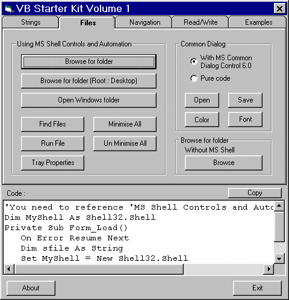



## Beginners Toolbox

### Description

Threw this together to answer a group of questions in the Discussion forum. It is intended to help those just starting VB. It demostrates string manipulation, file handling, simple navigation, reading and writing to files. It includes four example apps that include menus, window handling, file properties and a basic text editor. Code for each function appear in a textbox ready to copy into your project. I hope this is of some help to people beginning VB. Good luck.
 
### More Info
 

             |
---                |---
**Submitted On**   |2001-03-03 21:43:34
**By**             |[MrBobo](https://github.com/Planet-Source-Code/PSCIndex/blob/master/ByAuthor/mrbobo.md)
**Level**          |Beginner
**User Rating**    |4.8 (87 globes from 18 users)
**Compatibility**  |VB 6\.0
**Category**       |[Files/ File Controls/ Input/ Output](https://github.com/Planet-Source-Code/PSCIndex/blob/master/ByCategory/files-file-controls-input-output__1-3.md)
**World**          |[Visual Basic](https://github.com/Planet-Source-Code/PSCIndex/blob/master/ByWorld/visual-basic.md)
**Archive File**   |[CODE\_UPLOAD15750332001\.zip](https://github.com/Planet-Source-Code/mrbobo-beginners-toolbox__1-21483/archive/master.zip)

